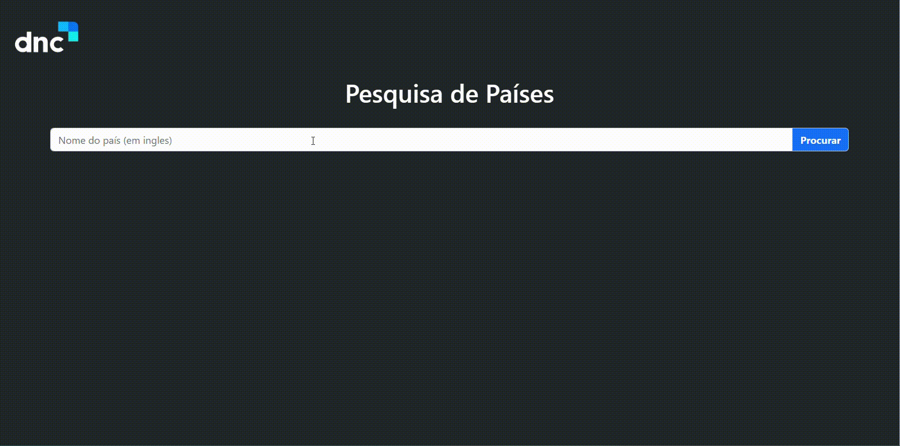

# Pesquisa de Países

este é um projeto consumindo API para pesquisar os paises.

## 🔨 Funcionalidades do projeto

É um projeto que consome uma api para pesquisar por paises e trazendo algumas informações como nome, capital, continente e população.

# 🛠️ Abrir e rodar o projeto
Após baixar o projeto, você pode abrir com o Android Studio. Para isso, na tela de launcher clique em:

- **Open an Existing Project** (ou alguma opção similar)
- Procure o local onde o projeto está e o selecione (Caso o projeto seja baixado via zip, é necessário extraí-lo antes de procurá-lo)
- Por fim clique em OK

## ✔️ Técnicas e tecnologias utilizadas

- ``HTML``
- ``BOOTSTRAP``
- ``JAVASCRIPT``

## 📁 Acesso ao projeto
Você pode acessar os arquivos do projeto clicando [aqui](https://github.com/Leandro-Pinho/Pesquisa-de-Paises).

